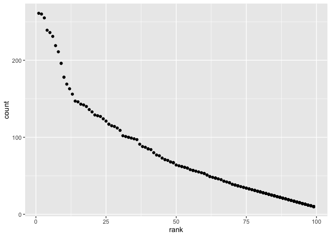

p8105\_hw2\_kh3074
================
KaiYu He(kh3074)

------------------------------------------------------------------------

``` r
library(tidyverse)
```

    ## ── Attaching packages ─────────────────────────────────────── tidyverse 1.3.1 ──

    ## ✓ ggplot2 3.3.5     ✓ purrr   0.3.4
    ## ✓ tibble  3.1.2     ✓ dplyr   1.0.7
    ## ✓ tidyr   1.1.3     ✓ stringr 1.4.0
    ## ✓ readr   2.0.1     ✓ forcats 0.5.1

    ## ── Conflicts ────────────────────────────────────────── tidyverse_conflicts() ──
    ## x dplyr::filter() masks stats::filter()
    ## x dplyr::lag()    masks stats::lag()

``` r
library(readxl)
```

------------------------------------------------------------------------

# Problem1

#### Read and clean the Mr. Trash Wheel sheet:

``` r
trash_weel_df = 
  read_excel("data/Trash-Wheel-Collection-Totals-8-6-19.xlsx") %>%
  janitor::clean_names()%>% #change to reasonable variable names
  select(dumpster:homes_powered)%>% #omit the columns with notes
  filter(dumpster != 'NA')%>% #omit rows that do not include dumpster-specific data
  mutate(sports_balls = round(sports_balls))#round the number of sports balls to the nearest integer
```

    ## New names:
    ## * `` -> ...15
    ## * `` -> ...16
    ## * `` -> ...17

``` r
trash_weel_df
```

    ## # A tibble: 344 x 14
    ##    dumpster month  year date                weight_tons volume_cubic_yards
    ##       <dbl> <chr> <dbl> <dttm>                    <dbl>              <dbl>
    ##  1        1 May    2014 2014-05-16 00:00:00        4.31                 18
    ##  2        2 May    2014 2014-05-16 00:00:00        2.74                 13
    ##  3        3 May    2014 2014-05-16 00:00:00        3.45                 15
    ##  4        4 May    2014 2014-05-17 00:00:00        3.1                  15
    ##  5        5 May    2014 2014-05-17 00:00:00        4.06                 18
    ##  6        6 May    2014 2014-05-20 00:00:00        2.71                 13
    ##  7        7 May    2014 2014-05-21 00:00:00        1.91                  8
    ##  8        8 May    2014 2014-05-28 00:00:00        3.7                  16
    ##  9        9 June   2014 2014-06-05 00:00:00        2.52                 14
    ## 10       10 June   2014 2014-06-11 00:00:00        3.76                 18
    ## # … with 334 more rows, and 8 more variables: plastic_bottles <dbl>,
    ## #   polystyrene <dbl>, cigarette_butts <dbl>, glass_bottles <dbl>,
    ## #   grocery_bags <dbl>, chip_bags <dbl>, sports_balls <dbl>,
    ## #   homes_powered <dbl>

``` r
summary(trash_weel_df)
```

    ##     dumpster         month                year     
    ##  Min.   :  1.00   Length:344         Min.   :2014  
    ##  1st Qu.: 86.75   Class :character   1st Qu.:2015  
    ##  Median :172.50   Mode  :character   Median :2017  
    ##  Mean   :172.50                      Mean   :2016  
    ##  3rd Qu.:258.25                      3rd Qu.:2018  
    ##  Max.   :344.00                      Max.   :2019  
    ##       date                      weight_tons    volume_cubic_yards
    ##  Min.   :2014-05-16 00:00:00   Min.   :0.960   Min.   : 7.00     
    ##  1st Qu.:2015-07-05 00:00:00   1st Qu.:2.757   1st Qu.:15.00     
    ##  Median :2017-03-31 00:00:00   Median :3.265   Median :15.00     
    ##  Mean   :2016-12-23 10:57:12   Mean   :3.263   Mean   :15.54     
    ##  3rd Qu.:2018-05-19 18:00:00   3rd Qu.:3.772   3rd Qu.:16.00     
    ##  Max.   :2019-06-17 00:00:00   Max.   :5.620   Max.   :20.00     
    ##  plastic_bottles   polystyrene   cigarette_butts  glass_bottles   
    ##  Min.   : 210.0   Min.   : 320   Min.   :   980   Min.   :  0.00  
    ##  1st Qu.: 957.5   1st Qu.:1065   1st Qu.:  7000   1st Qu.: 10.00  
    ##  Median :1835.0   Median :2075   Median : 19000   Median : 21.50  
    ##  Mean   :1873.2   Mean   :2139   Mean   : 30754   Mean   : 25.36  
    ##  3rd Qu.:2552.5   3rd Qu.:3120   3rd Qu.: 38000   3rd Qu.: 38.00  
    ##  Max.   :5960.0   Max.   :6540   Max.   :310000   Max.   :110.00  
    ##   grocery_bags    chip_bags       sports_balls   homes_powered  
    ##  Min.   :  50   Min.   : 230.0   Min.   : 0.00   Min.   : 0.00  
    ##  1st Qu.: 600   1st Qu.: 977.5   1st Qu.: 5.00   1st Qu.:35.62  
    ##  Median :1050   Median :1630.0   Median : 8.00   Median :51.42  
    ##  Mean   :1311   Mean   :1780.3   Mean   :11.81   Mean   :43.83  
    ##  3rd Qu.:1912   3rd Qu.:2490.0   3rd Qu.:16.00   3rd Qu.:59.50  
    ##  Max.   :3750   Max.   :5085.0   Max.   :56.00   Max.   :93.67

#### precipitation data for 2018 and 2019

``` r
precipitation_2018 = 
  read_excel("data/Trash-Wheel-Collection-Totals-8-6-19.xlsx",sheet = "2018 Precipitation",skip = 1)%>%
  janitor::clean_names()%>%
  mutate('year' = 2018)%>%
  drop_na()

  
precipitation_2019 = 
  read_excel("data/Trash-Wheel-Collection-Totals-8-6-19.xlsx",sheet = "2019 Precipitation", skip = 1)%>%
  janitor::clean_names()%>%
  mutate('year' = 2019)%>%
  drop_na()
  
precipitation_2018_2019 = 
  full_join(precipitation_2018,precipitation_2019)%>% 
  mutate(month = month.name[month])
```

    ## Joining, by = c("month", "total", "year")

``` r
precipitation_2018_2019
```

    ## # A tibble: 18 x 3
    ##    month     total  year
    ##    <chr>     <dbl> <dbl>
    ##  1 January    0.94  2018
    ##  2 February   4.8   2018
    ##  3 March      2.69  2018
    ##  4 April      4.69  2018
    ##  5 May        9.27  2018
    ##  6 June       4.77  2018
    ##  7 July      10.2   2018
    ##  8 August     6.45  2018
    ##  9 September 10.5   2018
    ## 10 October    2.12  2018
    ## 11 November   7.82  2018
    ## 12 December   6.11  2018
    ## 13 January    3.1   2019
    ## 14 February   3.64  2019
    ## 15 March      4.47  2019
    ## 16 April      1.46  2019
    ## 17 May        3.58  2019
    ## 18 June       0.42  2019

``` r
summary(precipitation_2018_2019)
```

    ##     month               total             year     
    ##  Length:18          Min.   : 0.420   Min.   :2018  
    ##  Class :character   1st Qu.: 2.792   1st Qu.:2018  
    ##  Mode  :character   Median : 4.580   Median :2018  
    ##                     Mean   : 4.833   Mean   :2018  
    ##                     3rd Qu.: 6.365   3rd Qu.:2019  
    ##                     Max.   :10.470   Max.   :2019

#### Conclusion

-   **Trash weel sheet**  
    Form **344** rows and **14** columns of data,  
    we can learn that Mr trash weel collect **3.0754128^{4}** cigarette
    butts per dumpster which is the most among all the trashes,  
    collect **3.262936** tons of trash per dumpster.  
    And the median number of sports balls in a dumpster in 2017 is **8**

-   **Precipitation sheet**  
    From **18** rows and **3** columns of data,  
    we can find out the mean precipitation per month is **4.8333333**,  
    total precipitation in 2018 is **70.33**.

# Problem 2

#### Clean DataSet of pols-month.csv

``` r
pols_month =
  read_csv("data/fivethirtyeight_datasets/pols-month.csv")%>%
  separate(mon, into = c("year", "month", "day"), sep="-") %>%
  mutate(month = as.double(month))%>%  #change the variable type to double
  mutate(month = month.name[month])
```

    ## Rows: 822 Columns: 9

    ## ── Column specification ────────────────────────────────────────────────────────
    ## Delimiter: ","
    ## dbl  (8): prez_gop, gov_gop, sen_gop, rep_gop, prez_dem, gov_dem, sen_dem, r...
    ## date (1): mon

    ## 
    ## ℹ Use `spec()` to retrieve the full column specification for this data.
    ## ℹ Specify the column types or set `show_col_types = FALSE` to quiet this message.

``` r
pols_month
```

    ## # A tibble: 822 x 11
    ##    year  month   day   prez_gop gov_gop sen_gop rep_gop prez_dem gov_dem sen_dem
    ##    <chr> <chr>   <chr>    <dbl>   <dbl>   <dbl>   <dbl>    <dbl>   <dbl>   <dbl>
    ##  1 1947  January 15           0      23      51     253        1      23      45
    ##  2 1947  Februa… 15           0      23      51     253        1      23      45
    ##  3 1947  March   15           0      23      51     253        1      23      45
    ##  4 1947  April   15           0      23      51     253        1      23      45
    ##  5 1947  May     15           0      23      51     253        1      23      45
    ##  6 1947  June    15           0      23      51     253        1      23      45
    ##  7 1947  July    15           0      23      51     253        1      23      45
    ##  8 1947  August  15           0      23      51     253        1      23      45
    ##  9 1947  Septem… 15           0      23      51     253        1      23      45
    ## 10 1947  October 15           0      23      51     253        1      23      45
    ## # … with 812 more rows, and 1 more variable: rep_dem <dbl>

``` r
pols_month_tidy = 
  pols_month%>%
  mutate(president = ifelse(prez_gop == 1,'Gop','Dem'))%>%
  select(-'day',-'prez_gop',-'prez_dem')
pols_month_tidy
```

    ## # A tibble: 822 x 9
    ##    year  month     gov_gop sen_gop rep_gop gov_dem sen_dem rep_dem president
    ##    <chr> <chr>       <dbl>   <dbl>   <dbl>   <dbl>   <dbl>   <dbl> <chr>    
    ##  1 1947  January        23      51     253      23      45     198 Dem      
    ##  2 1947  February       23      51     253      23      45     198 Dem      
    ##  3 1947  March          23      51     253      23      45     198 Dem      
    ##  4 1947  April          23      51     253      23      45     198 Dem      
    ##  5 1947  May            23      51     253      23      45     198 Dem      
    ##  6 1947  June           23      51     253      23      45     198 Dem      
    ##  7 1947  July           23      51     253      23      45     198 Dem      
    ##  8 1947  August         23      51     253      23      45     198 Dem      
    ##  9 1947  September      23      51     253      23      45     198 Dem      
    ## 10 1947  October        23      51     253      23      45     198 Dem      
    ## # … with 812 more rows

#### Clean data snp.csv

``` r
snp_df = 
  read.csv("data/fivethirtyeight_datasets/snp.csv")%>%
  separate(date,into = c('month','day','year'),sep ='/')%>%
  relocate(year)%>%
  select(-day)%>%
  mutate(month = as.numeric(month))%>% #Change the month name format 
  mutate(month = month.name[month])

unemp_df = 
  read.csv("data/fivethirtyeight_datasets/unemployment.csv")%>%
  pivot_longer(
    Jan:Dec,
    names_to = 'month',
    values_to = 'unemployment'
  )%>%
  mutate(month = match(month,month.abb))%>% #Change the month name format 
  mutate(month = month.name[month])%>%
  mutate(Year = as.character(Year))%>%  #make sure the datatype are the same
  janitor::clean_names()

#Join the datasets by merging snp into pols
pols_snp_df = left_join(pols_month_tidy,snp_df,by = c('year','month'))
pols_snp_df
```

    ## # A tibble: 822 x 10
    ##    year  month   gov_gop sen_gop rep_gop gov_dem sen_dem rep_dem president close
    ##    <chr> <chr>     <dbl>   <dbl>   <dbl>   <dbl>   <dbl>   <dbl> <chr>     <dbl>
    ##  1 1947  January      23      51     253      23      45     198 Dem          NA
    ##  2 1947  Februa…      23      51     253      23      45     198 Dem          NA
    ##  3 1947  March        23      51     253      23      45     198 Dem          NA
    ##  4 1947  April        23      51     253      23      45     198 Dem          NA
    ##  5 1947  May          23      51     253      23      45     198 Dem          NA
    ##  6 1947  June         23      51     253      23      45     198 Dem          NA
    ##  7 1947  July         23      51     253      23      45     198 Dem          NA
    ##  8 1947  August       23      51     253      23      45     198 Dem          NA
    ##  9 1947  Septem…      23      51     253      23      45     198 Dem          NA
    ## 10 1947  October      23      51     253      23      45     198 Dem          NA
    ## # … with 812 more rows

``` r
knitr::kable(tail(pols_snp_df)) # show some of the results
```

| year | month    | gov\_gop | sen\_gop | rep\_gop | gov\_dem | sen\_dem | rep\_dem | president |   close |
|:-----|:---------|---------:|---------:|---------:|---------:|---------:|---------:|:----------|--------:|
| 2015 | January  |       31 |       54 |      245 |       18 |       44 |      188 | Dem       | 1994.99 |
| 2015 | February |       31 |       54 |      245 |       18 |       44 |      188 | Dem       | 2104.50 |
| 2015 | March    |       31 |       54 |      245 |       18 |       44 |      188 | Dem       | 2067.89 |
| 2015 | April    |       31 |       54 |      244 |       18 |       44 |      188 | Dem       | 2085.51 |
| 2015 | May      |       31 |       54 |      245 |       18 |       44 |      188 | Dem       | 2107.39 |
| 2015 | June     |       31 |       54 |      246 |       18 |       44 |      188 | Dem       | 2063.11 |

``` r
#Merging unemployment into the result.
pols_snp_unemployment_df = left_join(pols_snp_df,unemp_df,by = c('year','month'))
pols_snp_unemployment_df
```

    ## # A tibble: 822 x 11
    ##    year  month   gov_gop sen_gop rep_gop gov_dem sen_dem rep_dem president close
    ##    <chr> <chr>     <dbl>   <dbl>   <dbl>   <dbl>   <dbl>   <dbl> <chr>     <dbl>
    ##  1 1947  January      23      51     253      23      45     198 Dem          NA
    ##  2 1947  Februa…      23      51     253      23      45     198 Dem          NA
    ##  3 1947  March        23      51     253      23      45     198 Dem          NA
    ##  4 1947  April        23      51     253      23      45     198 Dem          NA
    ##  5 1947  May          23      51     253      23      45     198 Dem          NA
    ##  6 1947  June         23      51     253      23      45     198 Dem          NA
    ##  7 1947  July         23      51     253      23      45     198 Dem          NA
    ##  8 1947  August       23      51     253      23      45     198 Dem          NA
    ##  9 1947  Septem…      23      51     253      23      45     198 Dem          NA
    ## 10 1947  October      23      51     253      23      45     198 Dem          NA
    ## # … with 812 more rows, and 1 more variable: unemployment <dbl>

``` r
knitr::kable(tail(pols_snp_unemployment_df))#show some of the results
```

| year | month    | gov\_gop | sen\_gop | rep\_gop | gov\_dem | sen\_dem | rep\_dem | president |   close | unemployment |
|:-----|:---------|---------:|---------:|---------:|---------:|---------:|---------:|:----------|--------:|-------------:|
| 2015 | January  |       31 |       54 |      245 |       18 |       44 |      188 | Dem       | 1994.99 |          5.7 |
| 2015 | February |       31 |       54 |      245 |       18 |       44 |      188 | Dem       | 2104.50 |          5.5 |
| 2015 | March    |       31 |       54 |      245 |       18 |       44 |      188 | Dem       | 2067.89 |          5.5 |
| 2015 | April    |       31 |       54 |      244 |       18 |       44 |      188 | Dem       | 2085.51 |          5.4 |
| 2015 | May      |       31 |       54 |      245 |       18 |       44 |      188 | Dem       | 2107.39 |          5.5 |
| 2015 | June     |       31 |       54 |      246 |       18 |       44 |      188 | Dem       | 2063.11 |          5.3 |

#### Data interpretation

-   pols\_month\_df is a **822** rows and **9** columns data which
    include numbers of government staffs grouped by gov sen and rep.
-   snp\_df is a **787** rows and **3** columns data record the closing
    values of the S&P stock index on the associated date.
-   unemployment\_df is a **816** rows and **3** columns data include
    numbers of percentage of unemployment on the associated date.
-   Combine all the data togather we can analyze the relationship
    between the proportion of government staffs and S&P stock index and
    unemployment.

# Problem 3

#### Load and tidy the data

``` r
baby_name_data = 
  read_csv("data/Popular_Baby_Names.csv")%>%
  janitor::clean_names()%>%
  mutate(gender = str_to_title(gender))%>%#First letter of gender capital
  mutate(ethnicity = str_to_title(ethnicity))%>% #First letter of ethnicity capital
  mutate(childs_first_name = str_to_title(childs_first_name))%>% #First letter of name capital
  dplyr::distinct()
```

    ## Rows: 19418 Columns: 6

    ## ── Column specification ────────────────────────────────────────────────────────
    ## Delimiter: ","
    ## chr (3): Gender, Ethnicity, Child's First Name
    ## dbl (3): Year of Birth, Count, Rank

    ## 
    ## ℹ Use `spec()` to retrieve the full column specification for this data.
    ## ℹ Specify the column types or set `show_col_types = FALSE` to quiet this message.

#### Female “Olivia”

``` r
female_olivia = 
  baby_name_data%>%
  filter(childs_first_name == 'Olivia',gender == 'Female')%>%
  select(year_of_birth,ethnicity,count,rank)%>%
  arrange(year_of_birth)%>%
  knitr::kable()
```

***female\_olivia\_reader\_friendly\_table***

``` r
female_olivia
```

| year\_of\_birth | ethnicity                  | count | rank |
|----------------:|:---------------------------|------:|-----:|
|            2011 | Asian And Pacific Islander |    89 |    4 |
|            2011 | Black Non Hispanic         |    52 |   10 |
|            2011 | Hispanic                   |    86 |   18 |
|            2011 | White Non Hispanic         |   213 |    2 |
|            2012 | Asian And Paci             |   132 |    3 |
|            2012 | Black Non Hisp             |    58 |    8 |
|            2012 | Hispanic                   |    77 |   22 |
|            2012 | White Non Hisp             |   198 |    4 |
|            2013 | Asian And Pacific Islander |   109 |    3 |
|            2013 | Black Non Hispanic         |    64 |    6 |
|            2013 | Hispanic                   |    87 |   22 |
|            2013 | White Non Hispanic         |   233 |    1 |
|            2014 | Asian And Pacific Islander |   141 |    1 |
|            2014 | Black Non Hispanic         |    52 |    8 |
|            2014 | Hispanic                   |    96 |   16 |
|            2014 | White Non Hispanic         |   248 |    1 |
|            2015 | Asian And Pacific Islander |   188 |    1 |
|            2015 | Black Non Hispanic         |    82 |    4 |
|            2015 | Hispanic                   |    94 |   16 |
|            2015 | White Non Hispanic         |   225 |    1 |
|            2016 | Asian And Pacific Islander |   172 |    1 |
|            2016 | Black Non Hispanic         |    49 |    8 |
|            2016 | Hispanic                   |   108 |   13 |
|            2016 | White Non Hispanic         |   230 |    1 |

#### Most popular name among male children

``` r
max_count_of_male_name =  #First find our which name is the most popular male name
  baby_name_data%>%
  filter(gender == 'Male')%>%
  select(childs_first_name,count)%>%
  group_by(childs_first_name)%>%
  summarise_all(funs(sum))%>%  # sum all the counts with same name
  filter(count == max(count))%>% #Find the most used name
  knitr::kable()
```

    ## Warning: `funs()` was deprecated in dplyr 0.8.0.
    ## Please use a list of either functions or lambdas: 
    ## 
    ##   # Simple named list: 
    ##   list(mean = mean, median = median)
    ## 
    ##   # Auto named with `tibble::lst()`: 
    ##   tibble::lst(mean, median)
    ## 
    ##   # Using lambdas
    ##   list(~ mean(., trim = .2), ~ median(., na.rm = TRUE))
    ## This warning is displayed once every 8 hours.
    ## Call `lifecycle::last_warnings()` to see where this warning was generated.

``` r
max_count_of_male_name
```

| childs\_first\_name | count |
|:--------------------|------:|
| Ethan               |  4245 |

-   Now we know **Ethan** is the most used name in male

``` r
male_ethan = 
  baby_name_data%>%
  filter(childs_first_name == 'Ethan',gender == 'Male')%>%
  select(year_of_birth,ethnicity,count,rank)%>%
  arrange(year_of_birth)%>%
  knitr::kable()
```

***male\_ethan\_reader\_friendly\_table***

``` r
male_ethan
```

| year\_of\_birth | ethnicity                  | count | rank |
|----------------:|:---------------------------|------:|-----:|
|            2011 | Asian And Pacific Islander |   177 |    1 |
|            2011 | Black Non Hispanic         |   124 |    6 |
|            2011 | Hispanic                   |   251 |    6 |
|            2011 | White Non Hispanic         |   118 |   26 |
|            2012 | Asian And Paci             |   187 |    2 |
|            2012 | Black Non Hisp             |   151 |    3 |
|            2012 | Hispanic                   |   254 |    4 |
|            2012 | White Non Hisp             |   131 |   21 |
|            2013 | Asian And Pacific Islander |   165 |    2 |
|            2013 | Black Non Hispanic         |   146 |    1 |
|            2013 | Hispanic                   |   252 |    5 |
|            2013 | White Non Hispanic         |   125 |   23 |
|            2014 | Asian And Pacific Islander |   179 |    2 |
|            2014 | Black Non Hispanic         |   138 |    1 |
|            2014 | Hispanic                   |   262 |    5 |
|            2014 | White Non Hispanic         |   149 |   18 |
|            2015 | Asian And Pacific Islander |   172 |    2 |
|            2015 | Black Non Hispanic         |   111 |    5 |
|            2015 | Hispanic                   |   332 |    3 |
|            2015 | White Non Hispanic         |   138 |   19 |
|            2016 | Asian And Pacific Islander |   193 |    1 |
|            2016 | Black Non Hispanic         |   107 |    5 |
|            2016 | Hispanic                   |   250 |    7 |
|            2016 | White Non Hispanic         |   133 |   20 |

#### Male white non-hispanic children born in 2016

``` r
non_hispanic_df =
  baby_name_data%>%
  filter(ethnicity == 'White Non Hispanic',year_of_birth == 2016,gender == 'Male')

ggplot(non_hispanic_df,aes(x = rank, y = count)) + geom_point()
```

<!-- -->

``` r
ggsave('Male white non-hispanic children born in 2016.png')
```

    ## Saving 7 x 5 in image
